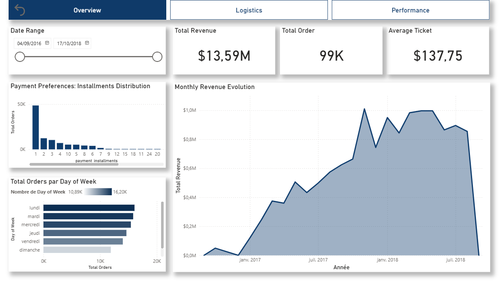
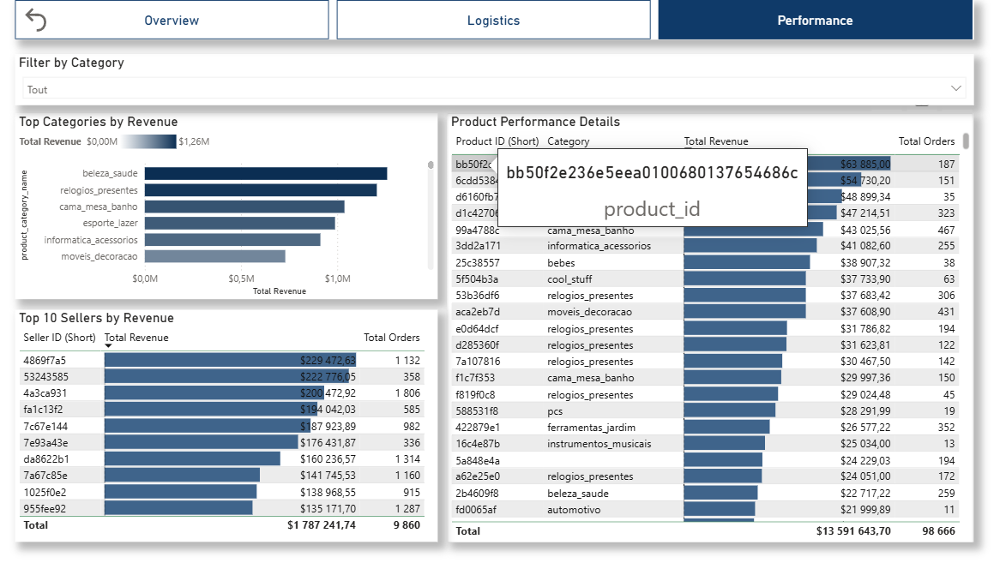
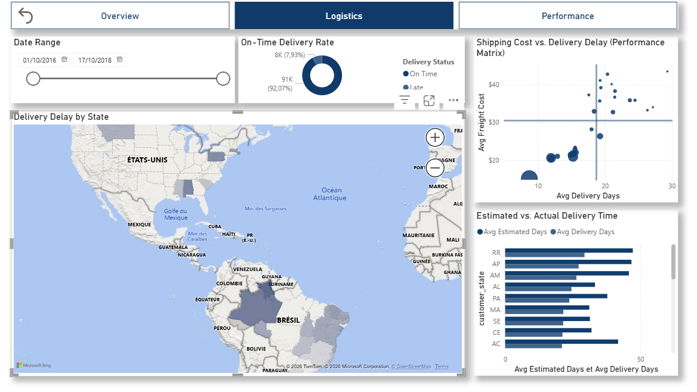

# Brazilian E-Commerce (Olist) — SQL Analysis & Business Performance

## Objective
Analyze the commercial performance of the Olist marketplace (Brazil) using a relational database to identify growth levers (revenue), assess customer loyalty (retention), and audit logistics efficiency across territories.

## Data
- Source: Brazilian E-Commerce Public Dataset by Olist
- Link: https://www.kaggle.com/datasets/olistbr/brazilian-ecommerce
- Files used: Orders, customers, payments, products, geolocation, sellers (9 CSV files converted to SQL tables).
- Analysis Level:
  - Transactional (Orders + Items)
  - Customer (Unique view via `customer_unique_id`)
  - Territorial (States/Cities)
The data is structured in a relational model (Star/Snowflake schema) to enable complex querying.
- Transformation:
  - Ingestion of raw data (CSV) and conversion to a SQL database (SQLite) via a Python ETL script.

## Methodology
1. Automated Ingestion (Python ETL Script)
2. Data Modeling (Relational Schema Creation)
3. Complex SQL Querying (Multi-table Joins, CTEs, Window Functions)
4. Geospatial & Temporal Analysis: Seasonal trends and regional logistics disparities.
5. Interactive Visualization (UX/UI):
- DAX Engineering: Custom "Short ID" logic for interface clarity.
- UX Optimization: Non-intrusive floating tooltips and bookmark-based navigation.

## Expected Results (MVP)
- Identify Revenue growth trends.
- Analyze top customer profiles (VIP/RFM Segmentation).
- Precisely measure customer retention rates (Cohort Analysis).
- Highlight regional logistical disparities (Delivery delays and freight costs).

## Repository Structure
```text
sql-ecommerce-analysis/
├─ assets/
├─ dashboard/
│  └─ ecommerce-vizualisation.pbix    # Interactive Power BI Dashboard  
├─ data/
│  └─ raw/              # Raw CSVs (Source Kaggle)
├─ db/
│  └─ ecommerce.db      # Generated SQLite Database
├─ queries/
│  ├─ 00_sanity_check.sql    # Quality control & exploration
│  ├─ 01_monthly_revenue.sql # Revenue Analysis & Growth
│  ├─ 02_vip_customers.sql   # Customer Segmentation
│  ├─ 03_cohort_retention.sql# Retention Analysis (Cohorts)
│  └─ 04_delivery_delay.sql  # Logistics Performance
├─ src/
│  └─ db_init.py        # Ingestion Script (CSV -> SQL)
├─ README.md
└─ requirements.txt     # (pandas for ETL)
```

## How to run

### Prerequisites
- Python 3.10+ (for ingestion)
- VS Code (with SQLTools extension recommended)
- Power BI Desktop (to view and interact with the .pbix dashboard)

### Installation (Windows PowerShell)
```powershell
# 1. Clone the repo and install Python dependencies
python -m venv .venv
.\.venv\Scripts\Activate.ps1
pip install pandas

# 2. Generate the Database
python src/db_init.py
```

### Execution
- SQL Analysis
Open and execute the SQL files in order via VS Code / SQLTools:
queries/00_sanity_check.sql
queries/01_monthly_revenue.sql ... and following.

- Interactive Dashboard
To access the advanced visual analysis and UX optimizations:
 - Navigate to the dashboard/ folder.
 - Open ecommerce-vizualisation.pbix with Power BI Desktop.
 
## Technical Implementation: UX & Data Optimization

### ID Shortening Strategy (DAX)
To solve the issue of 32-character hexadecimal UUIDs cluttering the UI, I implemented a Short ID system using the LEFT() function. This drastically improves table readability while maintaining data uniqueness.

Mathematical Validation (Entropy):
By keeping 8 characters, the number of unique combinations remains statistically sufficient for this dataset (~100k rows)

### Custom Floating Tooltips
To ensure the full technical ID remains accessible without obstructing the view:
- Dimensions: Custom canvas size of 80px x 300px.
- Transparency: Background set to 100% transparency to create a "floating" text effect over the data rows.

### Visual Polish & UI
- Data Bars: Added conditional formatting to Revenue columns to allow instantaneous comparative analysis.
- Renaming: Mapped technical database fields (e.g., product_category_name) to user-friendly labels (e.g., "Category") to reduce cognitive load.

## Results Overview



### Revenue Evolution
Query 01_monthly_revenue.sql and the Performance dashboard tab highlight seasonal spikes (Black Friday) and global trends.

### Customer Retention (Cohorts)
Query 03_cohort_retention.sql generates a retention matrix.
- Key Insight: The retention rate at Month+1 is less than 1%, indicating a model driven by continuous acquisition rather than loyalty.


### Logistics Performance
Query 04_delivery_delay.sql and the Logistics dashboard tab compares theoretical vs. actual delivery times.
- Regional Fracture: Northern states (Amazonas, Roraima) suffer delays > 25 days, compared to ~8 days for São Paulo.
- On-time Delivery: Analysis of theoretical vs. actual delivery times to identify bottleneck regions.


## Key insights (TL;DR)

- Revenue: Strong seasonality observed at year-end (November), but volatile year-over-year growth.

- Customers: A minority of "VIP" customers generate high-value orders, but purchasing behavior is predominantly "One-shot."

- Retention: Critical retention issue. The repurchase rate is near-zero, which is typical for durable goods (furniture) but suggests a lack of return incentives (CRM).

- Logistics: Major territorial fracture. Delivery is fast and cheap in the South-East but becomes a blocking factor (3x delays) for expansion into Northern regions.

